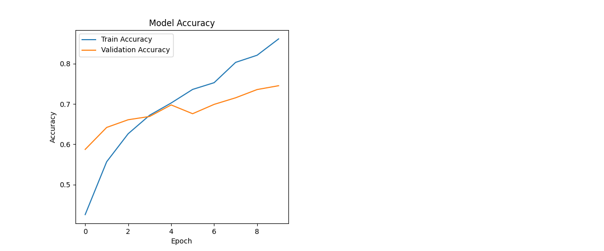
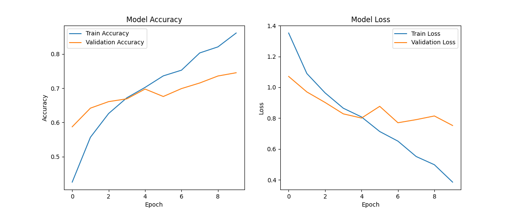

<p align="center">
  
  
  
  
</p>

<h1 align="center">🌸 CNN ile Çiçek Sınıflandırma</h1>

<p align="center">
  <strong>Convolutional Neural Network (CNN) kullanarak 5 farklı çiçek türünü sınıflandıran derin öğrenme projesi</strong>
</p>

<p align="center">
  <em>TensorFlow Flowers veri seti üzerinde eğitilmiş, veri artırma (data augmentation) ve callback mekanizmaları ile optimize edilmiş bir model.</em>
</p>

---

## 📖 Proje Hakkında

Bu proje, **Convolutional Neural Network (CNN)** mimarisi kullanarak çiçek görüntülerini otomatik olarak sınıflandırmayı amaçlamaktadır. TensorFlow'un sunduğu `tf_flowers` veri seti üzerinde eğitilen model, **5 farklı çiçek türünü** yüksek doğrulukla tanıyabilmektedir.

### 🌼 Sınıflandırılan Çiçek Türleri

| # | Çiçek Türü | İngilizce |
|---|-----------|-----------|
| 0 | 🌻 Ayçiçeği | Sunflower |
| 1 | 🌷 Lale | Tulip |
| 2 | 🌹 Gül | Rose |
| 3 | 🌼 Papatya | Daisy |
| 4 | 🌺 Karahindiba | Dandelion |

---

## 🏗️ Model Mimarisi

Model, **Sequential API** kullanılarak oluşturulmuş bir CNN mimarisine sahiptir:

```
┌─────────────────────────────────────────────┐
│          GİRİŞ KATMANI (180x180x3)         │
├─────────────────────────────────────────────┤
│     Conv2D (32 filtre, 3x3) + ReLU         │
│     MaxPooling2D (2x2)                      │
├─────────────────────────────────────────────┤
│     Conv2D (64 filtre, 3x3) + ReLU         │
│     MaxPooling2D (2x2)                      │
├─────────────────────────────────────────────┤
│     Conv2D (128 filtre, 3x3) + ReLU        │
│     MaxPooling2D (2x2)                      │
├─────────────────────────────────────────────┤
│             Flatten                          │
├─────────────────────────────────────────────┤
│       Dense (128 nöron) + ReLU              │
│       Dropout (0.5)                          │
├─────────────────────────────────────────────┤
│    Dense (5 sınıf) + Softmax — ÇIKIŞ       │
└─────────────────────────────────────────────┘
```

### Mimari Tasarım Kararları

| Bileşen | Açıklama |
|---------|----------|
| **3×3 Filtreler** | Küçük filtrelerin üst üste kullanılarak daha büyük reseptif alanlar elde edilmesi, az parametre ile güçlü özellik çıkarımı |
| **Artan Filtre Sayısı (32→64→128)** | Katman derinleştikçe daha soyut ve karmaşık özelliklerin öğrenilmesi |
| **MaxPooling** | Uzamsal boyutun azaltılması, hesaplama maliyetinin düşürülmesi ve öteleme değişmezliği |
| **Dropout (0.5)** | Rastgele nöronların devre dışı bırakılarak aşırı öğrenmenin (overfitting) önlenmesi |

---

## 🔄 Veri Ön İşleme ve Artırma

### Eğitim Seti Dönüşümleri
- 📐 **Yeniden Boyutlandırma** → 180×180 piksel
- 🔀 **Rastgele Yatay Çevirme** — Modelin yönden bağımsız öğrenmesi
- ☀️ **Rastgele Parlaklık Değişimi** — Farklı aydınlatma koşullarına dayanıklılık
- 🎨 **Rastgele Kontrast Değişimi** — Renk varyasyonlarına uyum
- ✂️ **Rastgele Kırpma** — Pozisyon bağımsızlığı
- 📊 **Normalizasyon** (0–1 aralığı) — Eğitim kararlılığı

### Doğrulama Seti Dönüşümleri
- 📐 **Yeniden Boyutlandırma** → 180×180 piksel
- 📊 **Normalizasyon** (0–1 aralığı)

---

## ⚙️ Eğitim Konfigürasyonu

| Parametre | Değer |
|-----------|-------|
| **Optimizer** | Adam (lr=0.001) |
| **Kayıp Fonksiyonu** | Sparse Categorical Crossentropy |
| **Batch Boyutu** | 32 |
| **Epoch Sayısı** | 10 |
| **Eğitim/Doğrulama Oranı** | %80 / %20 |

### Callback Mekanizmaları

| Callback | Açıklama |
|----------|----------|
| **EarlyStopping** | `val_loss` 3 epoch boyunca iyileşmezse eğitimi durdurur, en iyi ağırlıkları geri yükler |
| **ReduceLROnPlateau** | `val_loss` 2 epoch boyunca iyileşmezse öğrenme oranını %80 azaltır |
| **ModelCheckpoint** | Eğitim süresince en düşük `val_loss` değerine sahip modeli `best_model.h5` olarak kaydeder |

---

## 📊 Eğitim Sonuçları

### Doğruluk Grafiği
<p align="center">
  
</p>

### Kayıp Grafiği
<p align="center">
  
</p>

> **📈 Sonuç:** Model, 10 epoch eğitim sonucunda eğitim setinde **~%85**, doğrulama setinde **~%75** doğruluk oranına ulaşmıştır. Eğitim ve doğrulama kayıpları arasındaki fark, hafif bir aşırı öğrenme eğilimini gösterse de, Dropout ve Data Augmentation sayesinde bu kontrol altında tutulmuştur.

---

## 🚀 Kurulum ve Çalıştırma

### Gereksinimler

```bash
Python 3.9+
TensorFlow 2.10+
```

### Adım Adım Kurulum

```bash
# 1. Repoyu klonlayın
git clone https://github.com/Meszn/CNN_Cicek_Siniflandirma.git
cd CNN_Cicek_Siniflandirma

# 2. Sanal ortam oluşturun
python -m venv venv

# 3. Sanal ortamı aktif edin
# Windows:
venv\Scripts\activate
# macOS/Linux:
source venv/bin/activate

# 4. Bağımlılıkları yükleyin
pip install -r requirements.txt

# 5. Modeli eğitin
python cnn.py
```

> **💡 Not:** İlk çalıştırmada `tf_flowers` veri seti otomatik olarak indirilecektir (~218MB).

---

## 📁 Proje Yapısı

```
CNN_Cicek_Siniflandirma/
│
├── cnn.py                          # Ana model kodu (CNN mimarisi, eğitim, değerlendirme)
├── requirements.txt                # Python bağımlılıkları
├── .gitignore                      # Git tarafından izlenmeyen dosyalar
├── LICENSE                         # MIT Lisansı
├── README.md                       # Proje dokümantasyonu
│
├── training_history_accuracy.png   # Eğitim doğruluk grafiği
└── training_history_loss.png       # Eğitim kayıp grafiği
```


## 🛠️ Kullanılan Teknolojiler

<p align="center">
  
  
  
  
  
</p>

---

## 📄 Lisans

Bu proje [MIT Lisansı](LICENSE) altında lisanslanmıştır.

---

<p align="center">
  <strong>⭐ Bu projeyi beğendiyseniz yıldız vermeyi unutmayın!</strong>
</p>
